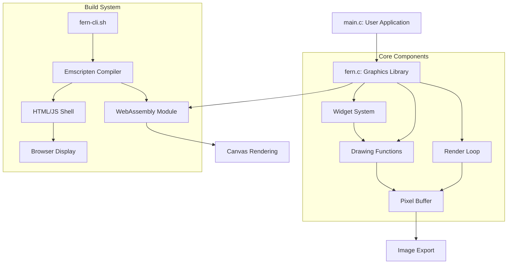

# Fern Graphics Library

<p align="center">
  
</p>

A lightweight graphics library for creating visual interactive applications using C or C++.
[Checkout Docs](https://fern.rishia.in)

## Important Notice: C++ Port in Progress

> **Note**: Fern is currently being ported to C++. The original C implementation is fully functional,
> while the C++ version is under active development. See the [Migration Guide](docs/migration-guide.md) 
> for details on transitioning between implementations.

## Table of Contents

- [Overview](#overview)
- [Key Features](#key-features)
- [Requirements](#requirements)
- [Installation](#installation)
- [Implementations](#implementations)
  - [C Implementation (Stable)](#c-implementation-stable)
  - [C++ Implementation (In Development)](#c-implementation-in-development)
- [Quick Start](#quick-start)
- [API Reference](#api-reference)
- [CLI Tool Usage](#cli-tool-usage)
- [Project Structure](#project-structure)
- [Contributing](#contributing)
- [License](#license)

## Overview

Fern is a minimalist graphics library designed for simplicity, performance, and ease of use. It provides a declarative API for rendering graphics to HTML canvas via WebAssembly, enabling developers to create visual applications that run in any modern web browser.

## Key Features

- WebAssembly-powered rendering for near-native performance
- Available in both C (stable) and C++ (in development) implementations
- Support for shapes, lines, gradients, and pixel manipulation
- Interactive UI elements including buttons with callbacks
- Mouse event capture and handling
- Simple CLI tool for compiling and serving applications
- Image export capability for saving renderings

## Requirements

- Emscripten SDK
- C compiler (C99 or later) or C++ compiler (C++14 or later)
- Python 3 (for development server)
- Web browser with WebAssembly support

## Installation

### Step 1: Install Dependencies

```bash
# Install Emscripten SDK
git clone https://github.com/emscripten-core/emsdk.git
cd emsdk
./emsdk install latest
./emsdk activate latest
source ./emsdk_env.sh
```

### Step 2: Install Fern CLI

```bash
# Clone the repository
git clone https://github.com/RishiAhuja/fern.git
git clone https://github.com/RishiAhuja/fern.git
cd fern

# Make the CLI script executable
chmod +x fern-cli.sh

# Create a symbolic link to make it available system-wide
sudo ln -s $(pwd)/fern-cli.sh /usr/local/bin/fern

# Optional: Install the man page
sudo install -m 644 fern.1 /usr/local/share/man/man1/
sudo mandb
```

## Quick Start

Create a basic application:

```c
// main.c
#include "fern.c"

#define WIDTH 800
#define HEIGHT 600

static uint32_t pixels[HEIGHT*WIDTH];

int main() {
    FernCanvas canvas = {pixels, HEIGHT, WIDTH};
    runApp(canvas);
    
    Container(
        color(Colors_blue),
        x(0),
        y(0),
        width(WIDTH),
        height(HEIGHT)
    );
    
    CircleWidget(
        radius(50),
        position(Point_create(WIDTH/2, HEIGHT/2)),
        color(Colors_red)
    );
    
    fern_start_render_loop();
    return 0;
}
```

Compile and run:

```bash
fern main.c
# Open http://localhost:8000/dist/ in your browser
```

## API Reference

### Core Types

#### `Point`
Represents a 2D point with x and y coordinates.

```c
struct Point {
    int x;
    int y;
};

// Create a Point
Point Point_create(int x, int y);
```

#### `FernCanvas`
Represents the drawing canvas.

```c
struct FernCanvas {
    uint32_t* pixels;
    size_t height;
    size_t width;
};
```
#### `GradientStop`
Represents a color stop in a gradient.

```c
typedef struct {
    uint32_t color;
    float position;  // 0.0 to 1.0
} GradientStop;
```
#### `LinearGradient`
Defines a linear gradient with multiple color stops.

```c
typedef struct {
    GradientStop* stops;
    int stop_count;
    int direction;  // GRADIENT_HORIZONTAL or GRADIENT_VERTICAL
} LinearGradient;

// Direction constants
#define GRADIENT_HORIZONTAL 0
#define GRADIENT_VERTICAL 1
```

#### `InputState`
Tracks the current state of user input.

```c
typedef struct {
    int mouse_x;      // Current mouse X position
    int mouse_y;      // Current mouse Y position
    int mouse_down;   // Whether mouse button is currently pressed
    int mouse_clicked; // Whether a click occurred in this frame
} InputState;

// Access the current input state
extern InputState current_input;
```


### Color Constants

Fern provides predefined color constants:

```c
#define Colors_green 0xFF00FF00   // Green
#define Colors_blue  0xFF0000FF   // Blue
#define Colors_red   0xFFFF0000   // Red
#define Colors_gray  0xFF202020   // Dark Gray
#define Colors_black 0xFF000000   // Black
#define Colors_white 0xFFFFFFFF   // White
```

Color format is 0xAARRGGBB (alpha, red, green, blue).

### Widget Functions

#### Container
Creates a rectangular container.

```c
Container(
    color(uint32_t color),
    x(int x),
    y(int y),
    width(int width),
    height(int height)
);
```

#### CenteredContainer
Creates a centered rectangular container.

```c
CenteredContainer(
    width(int width),
    height(int height),
    color(uint32_t color)
);
```

#### CircleWidget
Creates a circle.

```c
CircleWidget(
    radius(int radius),
    position(Point position),
    color(uint32_t color)
);
```

#### LineWidget
Creates a line with specified thickness.

```c
LineWidget(
    start(Point start),
    end(Point end),
    thickness(int thickness),
    color(uint32_t color)
);
```

#### TextWidget
Renders text using the built-in bitmap font.

```c
TextWidget(
    start(Point position),
    text(const char* text),
    scale(int scale),
    color(uint32_t color)
);
```

#### LinearGradientContainer
Creates a rectangle filled with a linear color gradient.

```c
LinearGradientContainer(
    x(int x),
    y(int y),
    width(int width),
    height(int height),
    gradient(LinearGradient gradient)
);

#### ButtonWidget
Creates an interactive button that responds to mouse events.

```c
typedef void (*ButtonCallback)(void);  // Function pointer type for callbacks

typedef struct {
    int x;
    int y;
    int width;
    int height;
    uint32_t normal_color;
    uint32_t hover_color;
    uint32_t press_color;
    const char* label;
    int text_scale;
    uint32_t text_color;
    ButtonCallback on_click;
} ButtonConfig;

void ButtonWidget(ButtonConfig config);
```
Example usage:

```c
void button_callback() {
    // Code executed when button is clicked
    fernPrintf("Button clicked!");
}

ButtonConfig my_button = {
    .x = 100,
    .y = 200,
    .width = 200,
    .height = 60,
    .normal_color = Colors_blue,
    .hover_color = 0xFF4444FF,  // Lighter blue
    .press_color = 0xFF0000AA,  // Darker blue
    .label = "CLICK ME",
    .text_scale = 2,
    .text_color = Colors_white,
    .on_click = button_callback
};

ButtonWidget(my_button);
```

### Core Drawing Functions

For more advanced use cases, you can use the lower-level drawing functions:

```c
// Fill entire canvas with a color
void ffill(uint32_t* pixels, size_t height, size_t width, uint32_t color);

// Draw a rectangle
void frect(uint32_t* pixels, size_t height, size_t width, uint32_t color, 
          size_t x, size_t y, size_t w, size_t h);

// Draw a circle
void fcircle(uint32_t* pixels, size_t height, size_t width, uint32_t color, 
            size_t cx, size_t cy, size_t r);

// Draw a line with thickness
void fline(uint32_t* pixels, size_t height, size_t width, uint32_t color, 
          int x1, int y1, int x2, int y2, int thickness);
    
// Render a single character from the bitmap font
void fchar(uint32_t* pixels, int width, int height, char c, int x, int y, int scale, uint32_t color);

// Render a text string using the bitmap font
void ftext(uint32_t* pixels, int width, int height, const char* text, int x, int y, int scale, uint32_t color);

// Get a color at a specific position in a gradient
uint32_t gradient_color_at(LinearGradient grad, float position);

// Print debug information to console
void fernPrintf(const char* message);

```

### Application Lifecycle

```c
// Initialize the application with a canvas
void runApp(FernCanvas canvas);

// Start the rendering loop
void fern_start_render_loop(void);

// Optional: Set a draw function to be called every frame
void fern_set_draw_callback(void (*draw_function)(void));
```
For basic applications, you can draw once and call fern_start_render_loop():

```c
int main() {
    // Initialize
    FernCanvas canvas = {pixels, HEIGHT, WIDTH};
    runApp(canvas);
    
    // Draw static content
    Container(/* parameters */);
    CircleWidget(/* parameters */);
    
    // Start rendering
    fern_start_render_loop();
    return 0;
}
```

For interactive applications, use a draw callback:

```c
// Global state variables
static int circle_radius = 50;

void on_button_click() {
    circle_radius += 10;  // Update state
}

void draw_frame() {
    // Clear background
    Container(color(Colors_black), x(0), y(0), width(WIDTH), height(HEIGHT));
    
    // Draw with current state
    CircleWidget(radius(circle_radius), position(Point_create(WIDTH/2, HEIGHT/2)), color(Colors_red));
    
    // Create interactive elements
    ButtonConfig button = {
        .x = 100, .y = 200, .width = 200, .height = 60,
        .normal_color = Colors_blue, .hover_color = 0xFF4444FF, .press_color = 0xFF0000AA,
        .label = "INCREASE SIZE", .text_scale = 2, .text_color = Colors_white,
        .on_click = on_button_click
    };
    ButtonWidget(button);
}

int main() {
    // Initialize
    FernCanvas canvas = {pixels, HEIGHT, WIDTH};
    runApp(canvas);
    
    // Set draw callback
    fern_set_draw_callback(draw_frame);
    
    // Start rendering
    fern_start_render_loop();
    return 0;
}
```

### PPM Export

The library provides a function to export renders as PPM images:

```c
// Save the current pixel buffer as a PPM file
int fsave_ppm(uint32_t* pixels, size_t width, size_t height, const char* filename);

// Example usage
fsave_ppm(canvas.pixels, canvas.width, canvas.height, "output.ppm");
```

## Advanced Techniques

### Creating Filled Shapes

To create filled triangle shapes:

```c
// Fill a triangle using fan pattern
for (int i = 0; i < 180; i++) {
    int baseX = leftX + i * (rightX-leftX)/180;
    
    LineWidget(
        start(Point_create(baseX, baseY)),  
        end(Point_create(peakX, peakY)), 
        thickness(1),
        color(Colors_gray)  
    );
}
```
### Creating Gradients
To create and use a gradient:

```c
// Create gradient stops
GradientStop sunset_stops[] = {
    {0xFF330066, 0.0},  // Deep purple at the top
    {0xFFFF6600, 0.4},  // Orange at 40%
    {0xFF000033, 0.7},  // Dark blue at 70%
    {0xFF000000, 1.0}   // Black at the bottom
};

// Create the gradient
LinearGradient sunset_gradient = {
    sunset_stops,
    4,               // Number of stops
    GRADIENT_VERTICAL  // Direction
};

// Draw the gradient
LinearGradientContainer(0, 0, WIDTH, HEIGHT, sunset_gradient);
```

### Text Rendering
Rendering text with different scales:


```c
// Draw a large title
TextWidget(
    Point_create(WIDTH/2 - 150, 50),
    "FERN GRAPHICS",
    4,  // Scale factor
    NEON_GREEN
);

// Draw a smaller subtitle
TextWidget(
    Point_create(WIDTH/2 - 120, 100),
    "TEXT RENDERING DEMO",
    2,  // Scale factor
    Colors_white
);
```
You can also access the lower-level text functions:
```c
// Draw a single character
fchar(pixels, WIDTH, HEIGHT, 'A', 100, 100, 3, Colors_red);

// Draw custom-spaced text
int x = 50;
const char* message = "CUSTOM SPACING";
for(int i = 0; message[i] != '\0'; i++) {
    fchar(pixels, WIDTH, HEIGHT, message[i], x, 200, 2, Colors_blue);
    x += 20;  // Custom character spacing
}
```

### Creating Scene Components

You can create reusable scene components by defining functions:

```c
// Draw a cloud at the specified position
void drawCloud(int x, int y, int size) {
    CircleWidget(
        radius(size),
        position(Point_create(x, y)),
        color(Colors_white)
    );
    
    CircleWidget(
        radius(size * 1.2),
        position(Point_create(x + size, y - 5)),
        color(Colors_white)
    );
    
    CircleWidget(
        radius(size),
        position(Point_create(x + size*2, y)),
        color(Colors_white)
    );
}
```

### Interactive Applications
Fern supports interactive applications with mouse input and callbacks:

```c
// Frame counter example with button interaction
static int frame_count = 0;
static int background_color = Colors_black;

void toggle_background() {
    if (background_color == Colors_black) {
        background_color = 0xFF003366;  // Dark blue
    } else {
        background_color = Colors_black;
    }
}

void draw_frame() {
    // Update frame counter
    frame_count++;
    
    // Draw background
    Container(
        color(background_color),
        x(0), y(0),
        width(WIDTH), height(HEIGHT)
    );
    
    // Draw frame counter
    char text[32];
    sprintf(text, "FRAME: %d", frame_count);
    
    TextWidget(
        Point_create(50, 50),
        text,
        2,
        Colors_white
    );
    
    // Draw mouse position
    sprintf(text, "MOUSE: %d,%d", current_input.mouse_x, current_input.mouse_y);
    TextWidget(
        Point_create(50, 100),
        text,
        2,
        Colors_white
    );
    
    // Interactive button
    ButtonConfig button = {
        .x = WIDTH/2 - 100, 
        .y = HEIGHT/2 - 30, 
        .width = 200, 
        .height = 60,
        .normal_color = 0xFF444499,
        .hover_color = 0xFF6666BB,
        .press_color = 0xFF222277,
        .label = "CHANGE COLOR",
        .text_scale = 2,
        .text_color = Colors_white,
        .on_click = toggle_background
    };
    
    ButtonWidget(button);
}
```

## CLI Tool Usage

```
fern [FILENAME]
```

- If FILENAME is not provided, looks for main.c or example.c in the current directory
- Compiles the specified file to WebAssembly
- Creates a dist/ directory if it doesn't exist
- Starts a local web server
- Open http://localhost:8000/dist/ in your browser

## Project Structure



## Contributing

Contributions are welcome! Please feel free to submit a Pull Request.

## License

This project is licensed under the MIT License - see the LICENSE file for details.
