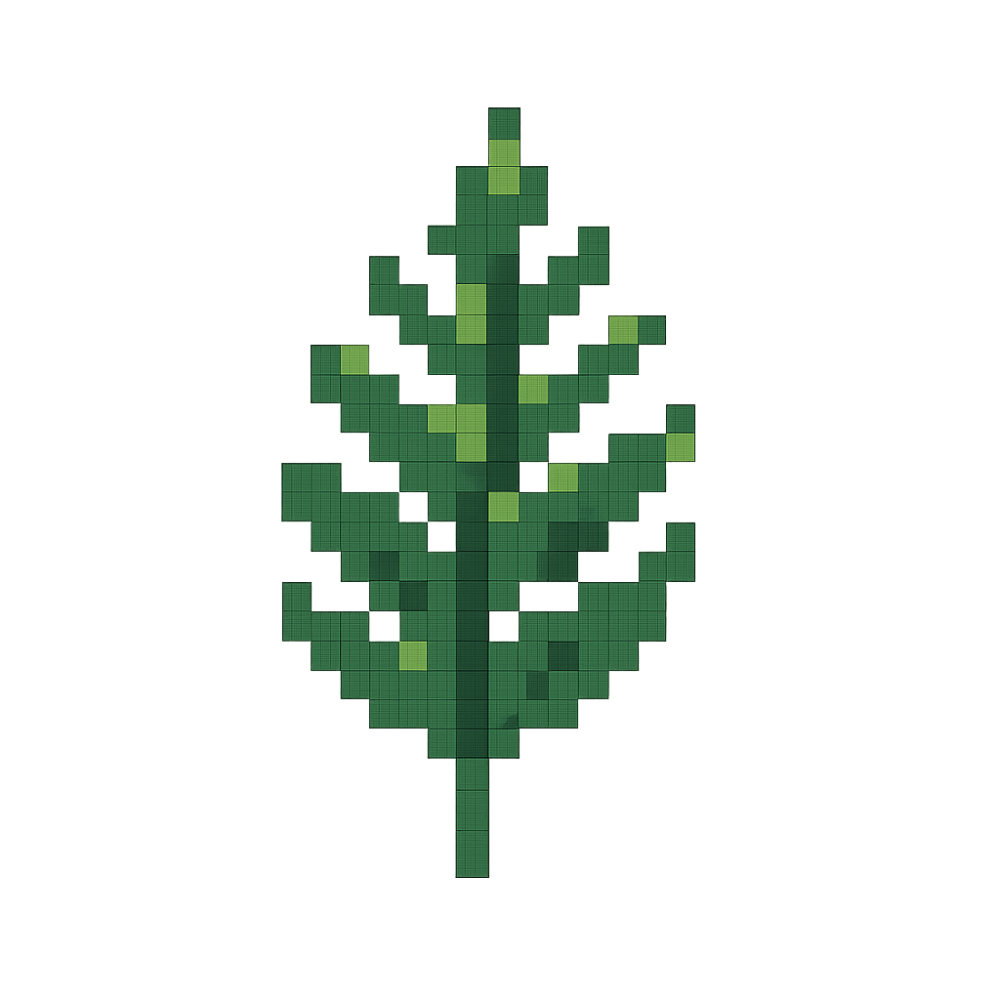
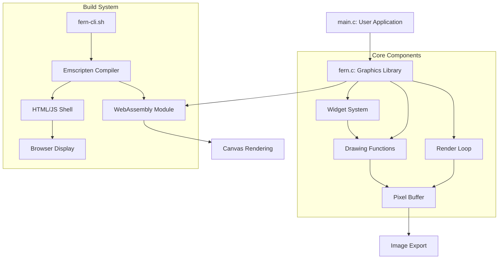
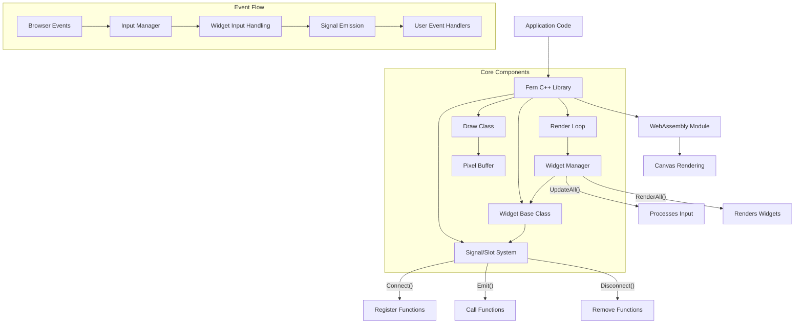

# Fern Graphics Library

<p align="center">
  
</p>

A lightweight graphics library for creating visual interactive applications using C or C++.
[Checkout C implementation Docs](https://fern.rishia.in)

## Important Notice: C++ Port in Progress

> **Note**: Fern is currently being ported to C++. The original C implementation is fully functional,
> while the C++ version is under active development. See the [Migration Guide](docs/migration-guide.md) 
> for details on transitioning between implementations.

## Table of Contents

- [Overview](#overview)
- [Key Features](#key-features)
- [Requirements](#requirements)
- [Installation](#installation)
- [Implementations](#implementations)
  - [C Implementation (Stable)](#c-implementation-stable)
  - [C++ Implementation (In Development)](#c-implementation-in-development)
- [Quick Start](#quick-start)
- [API Reference](#api-reference)
- [CLI Tool Usage](#cli-tool-usage)
- [Project Structure](#project-structure)
- [Contributing](#contributing)
- [License](#license)

## Overview

Fern is a minimalist graphics library designed for simplicity, performance, and ease of use. It provides a declarative API for rendering graphics to HTML canvas via WebAssembly, enabling developers to create visual applications that run in any modern web browser.

## Key Features

- WebAssembly-powered rendering for near-native performance
- Available in both C (stable) and C++ (in development) implementations
- Support for shapes, lines, gradients, and pixel manipulation
- Signal/Slot event system for flexible event handling (C++)
- Automatic widget lifecycle management (C++)
- Interactive UI elements with comprehensive event handling
- Mouse event capture and processing
- Simple CLI tool for compiling and serving applications
- Image export capability for saving renderings

## Requirements

- Emscripten SDK
- C compiler (C99 or later) or C++ compiler (C++14 or later)
- Python 3 (for development server)
- Web browser with WebAssembly support

## Installation

### Step 1: Install Dependencies

```bash
# Install Emscripten SDK
git clone https://github.com/emscripten-core/emsdk.git
cd emsdk
./emsdk install latest
./emsdk activate latest
source ./emsdk_env.sh
```

### Step 2: Install Fern CLI

```bash
# Clone the repository
git clone https://github.com/RishiAhuja/fern.git
cd fern

# Make the CLI script executable
chmod +x fern-cli.sh

# Create a symbolic link to make it available system-wide
sudo ln -s $(pwd)/fern-cli.sh /usr/local/bin/fern

# Optional: Install the man page
sudo install -m 644 fern.1 /usr/local/share/man/man1/
sudo mandb
```

## Implementations

### C Implementation (Stable)
The original C implementation provides a simple, function-based API with callbacks for event handling. The C version is stable and feature-complete.

### C++ Implementation (In Development)
The C++ implementation enhances Fern with object-oriented design principles and modern C++ features:

- **Signal/Slot Event System**: Instead of simple callbacks, widgets emit signals that can be connected to multiple slot functions
- **Widget Management**: Automatic lifecycle and input handling through a central widget manager
- **Smart Pointers**: Automatic memory management with shared_ptr for widgets
- **Type Safety**: Improved type checking and error detection at compile time
- **Inheritance Hierarchy**: Extensible widget class hierarchy

The C++ version maintains the same core rendering capabilities while providing a more robust foundation for complex applications.

## Quick Start

Create a basic C application:

```c
// main.c
#include "fern.c"

#define WIDTH 800
#define HEIGHT 600

static uint32_t pixels[HEIGHT*WIDTH];

int main() {
    FernCanvas canvas = {pixels, HEIGHT, WIDTH};
    runApp(canvas);
    
    Container(
        color(Colors_blue),
        x(0),
        y(0),
        width(WIDTH),
        height(HEIGHT)
    );
    
    CircleWidget(
        radius(50),
        position(Point_create(WIDTH/2, HEIGHT/2)),
        color(Colors_red)
    );
    
    fern_start_render_loop();
    return 0;
}
```

Compile and run:

```bash
fern main.c
```

Create a basic C++ application:

```cpp
// main.cpp
#include <fern/fern.hpp>
#include <memory>
#include <iostream>

using namespace Fern;

#define WIDTH 800
#define HEIGHT 600

static uint32_t pixels[HEIGHT*WIDTH];
static std::shared_ptr<Button> button;

void setupUI() {
    // Create a button with the signal/slot pattern
    ButtonConfig config = {
        .x = WIDTH/2 - 100, 
        .y = HEIGHT/2 - 30, 
        .width = 200, 
        .height = 60,
        .normalColor = Colors::Blue,
        .hoverColor = Colors::LightBlue,
        .pressColor = Colors::DarkBlue,
        .label = "CLICK ME",
        .textScale = 2,
        .textColor = Colors::White
    };
    
    button = ButtonWidget(config);
    button->onClick.connect([]() {
        std::cout << "Button clicked!" << std::endl;
    });
}

void draw() {
    Draw::fill(Colors::DarkGray);
    TextWidget(Point(50, 50), "FERN C++ DEMO", 3, Colors::White);
}

int main() {
    Fern::initialize(pixels, WIDTH, HEIGHT);
    setupUI();
    Fern::setDrawCallback(draw);
    Fern::startRenderLoop();
    return 0;
}
```

Compile and run:

```bash
fern --cpp main.cpp
```

## API Reference

### Core Types

#### `Point`
Represents a 2D point with x and y coordinates.

```c
struct Point {
    int x;
    int y;
};

// Create a Point
Point Point_create(int x, int y);
```

#### `FernCanvas`
Represents the drawing canvas.

```c
struct FernCanvas {
    uint32_t* pixels;
    size_t height;
    size_t width;
};
```
#### `GradientStop`
Represents a color stop in a gradient.

```c
typedef struct {
    uint32_t color;
    float position;  // 0.0 to 1.0
} GradientStop;
```
#### `LinearGradient`
Defines a linear gradient with multiple color stops.

```c
typedef struct {
    GradientStop* stops;
    int stop_count;
    int direction;  // GRADIENT_HORIZONTAL or GRADIENT_VERTICAL
} LinearGradient;

// Direction constants
#define GRADIENT_HORIZONTAL 0
#define GRADIENT_VERTICAL 1
```

#### `InputState`
Tracks the current state of user input.

```c
typedef struct {
    int mouse_x;      // Current mouse X position
    int mouse_y;      // Current mouse Y position
    int mouse_down;   // Whether mouse button is currently pressed
    int mouse_clicked; // Whether a click occurred in this frame
} InputState;

// Access the current input state
extern InputState current_input;
```


### Color Constants

Fern provides predefined color constants:

```c
#define Colors_green 0xFF00FF00   // Green
#define Colors_blue  0xFF0000FF   // Blue
#define Colors_red   0xFFFF0000   // Red
#define Colors_gray  0xFF202020   // Dark Gray
#define Colors_black 0xFF000000   // Black
#define Colors_white 0xFFFFFFFF   // White
```

Color format is 0xAARRGGBB (alpha, red, green, blue).

### Widget Functions

#### Container
Creates a rectangular container.

```c
Container(
    color(uint32_t color),
    x(int x),
    y(int y),
    width(int width),
    height(int height)
);
```

#### CenteredContainer
Creates a centered rectangular container.

```c
CenteredContainer(
    width(int width),
    height(int height),
    color(uint32_t color)
);
```

#### CircleWidget
Creates a circle.

```c
CircleWidget(
    radius(int radius),
    position(Point position),
    color(uint32_t color)
);
```

#### LineWidget
Creates a line with specified thickness.

```c
LineWidget(
    start(Point start),
    end(Point end),
    thickness(int thickness),
    color(uint32_t color)
);
```

#### TextWidget
Renders text using the built-in bitmap font.

```c
TextWidget(
    start(Point position),
    text(const char* text),
    scale(int scale),
    color(uint32_t color)
);
```

#### LinearGradientContainer
Creates a rectangle filled with a linear color gradient.

```c
LinearGradientContainer(
    x(int x),
    y(int y),
    width(int width),
    height(int height),
    gradient(LinearGradient gradient)
);

#### ButtonWidget
Creates an interactive button that responds to mouse events.

```c
typedef void (*ButtonCallback)(void);  // Function pointer type for callbacks

typedef struct {
    int x;
    int y;
    int width;
    int height;
    uint32_t normal_color;
    uint32_t hover_color;
    uint32_t press_color;
    const char* label;
    int text_scale;
    uint32_t text_color;
    ButtonCallback on_click;
} ButtonConfig;

void ButtonWidget(ButtonConfig config);
```
Example usage:

```c
void button_callback() {
    // Code executed when button is clicked
    fernPrintf("Button clicked!");
}

ButtonConfig my_button = {
    .x = 100,
    .y = 200,
    .width = 200,
    .height = 60,
    .normal_color = Colors_blue,
    .hover_color = 0xFF4444FF,  // Lighter blue
    .press_color = 0xFF0000AA,  // Darker blue
    .label = "CLICK ME",
    .text_scale = 2,
    .text_color = Colors_white,
    .on_click = button_callback
};

ButtonWidget(my_button);
```

#### ButtonWidget (C++ Version)
Creates an interactive button that responds to mouse events using the Signal/Slot pattern.

```cpp
struct ButtonConfig {
    int x;
    int y;
    int width;
    int height;
    uint32_t normalColor;
    uint32_t hoverColor;
    uint32_t pressColor;
    std::string label;
    int textScale;
    uint32_t textColor;
};

// Create a button and automatically register it with the widget manager
std::shared_ptr<Button> ButtonWidget(const ButtonConfig& config);

// Button class with signals
class Button : public Widget {
public:
    // Signals
    Signal<> onClick;        // Emitted when button is clicked
    Signal<bool> onHover;    // Emitted when hover state changes
    Signal<bool> onPress;    // Emitted when press state changes
    
    // ... other methods
};
```
Example usage:

```cpp
ButtonConfig config = {
    .x = 100,
    .y = 200,
    .width = 200,
    .height = 60,
    .normalColor = Colors::Blue,
    .hoverColor = Colors::LightBlue,
    .pressColor = Colors::DarkBlue,
    .label = "CLICK ME",
    .textScale = 2,
    .textColor = Colors::White
};

auto button = ButtonWidget(config);

// Connect multiple handlers to signals
button->onClick.connect([]() {
    std::cout << "Button was clicked!" << std::endl;
});

button->onHover.connect([](bool isHovered) {
    std::cout << (isHovered ? "Mouse over button" : "Mouse left button") << std::endl;
});

```

### Signal/Slot Event System (C++)

The C++ implementation uses a Signal/Slot pattern for event handling:

```cpp
// Define a signal with specific parameter types
Signal<int, std::string> mySignal;

// Connect functions (slots) to the signal
ConnectionID id1 = mySignal.connect([](int value, const std::string& msg) {
    std::cout << "Handler 1: " << value << " - " << msg << std::endl;
});

// Connect another handler
mySignal.connect([](int value, const std::string& msg) {
    std::cout << "Handler 2: " << value << " - " << msg << std::endl;
});

// Emit the signal - all connected handlers will be called
mySignal.emit(42, "Hello World");

// Disconnect a specific handler by its ID
mySignal.disconnect(id1);
```

This system provides several advantages:
- Multiple handlers can respond to the same event
- Events and handlers are decoupled (widgets don't need to know about handlers)
- Type-safe parameter passing between event sources and handlers
- Dynamic connection and disconnection at runtime

### Widget Management (C++)

The C++ implementation includes a widget management system that handles:

```cpp
// Add a widget to the manager
std::shared_ptr<Widget> myWidget = /* create widget */;
addWidget(myWidget);

// Widget manager handles:
// - Input distribution (in correct Z-order)
// - Automatic rendering
// - Lifecycle management
```

When you create widgets using factory functions like `ButtonWidget()`, they are 
automatically registered with the widget manager.

The widget manager maintains strong references to all widgets, ensuring they persist
even if local variables go out of scope, and automatically handles input propagation
and rendering during each frame of the render loop.

### Core Drawing Functions

#### C Drawing API

For more advanced use cases, you can use the lower-level drawing functions:

```c
// Fill entire canvas with a color
void ffill(uint32_t* pixels, size_t height, size_t width, uint32_t color);

// Draw a rectangle
void frect(uint32_t* pixels, size_t height, size_t width, uint32_t color, 
          size_t x, size_t y, size_t w, size_t h);

// Draw a circle
void fcircle(uint32_t* pixels, size_t height, size_t width, uint32_t color, 
            size_t cx, size_t cy, size_t r);

// Draw a line with thickness
void fline(uint32_t* pixels, size_t height, size_t width, uint32_t color, 
          int x1, int y1, int x2, int y2, int thickness);
    
// Render a single character from the bitmap font
void fchar(uint32_t* pixels, int width, int height, char c, int x, int y, int scale, uint32_t color);

// Render a text string using the bitmap font
void ftext(uint32_t* pixels, int width, int height, const char* text, int x, int y, int scale, uint32_t color);

// Get a color at a specific position in a gradient
uint32_t gradient_color_at(LinearGradient grad, float position);

// Print debug information to console
void fernPrintf(const char* message);

```

#### C++ Drawing API
The C++ implementation provides a static `Draw` class for rendering:

```cpp
namespace Fern {
    namespace Draw {
        // Fill entire canvas with a color
        void fill(uint32_t color);
        
        // Draw a rectangle
        void rect(int x, int y, int width, int height, uint32_t color);
        
        // Draw a circle
        void circle(int centerX, int centerY, int radius, uint32_t color);
        
        // Draw a line with thickness
        void line(int x1, int y1, int x2, int y2, int thickness, uint32_t color);
        
        // Get current canvas dimensions
        int getWidth();
        int getHeight();
        
        // Set a specific pixel
        void setPixel(int x, int y, uint32_t color);
        
        // Get color of a specific pixel
        uint32_t getPixel(int x, int y);
    }
}
```

### Application Lifecycle

#### C Implementation
```c
// Initialize the application with a canvas
void runApp(FernCanvas canvas);

// Start the rendering loop
void fern_start_render_loop(void);

// Optional: Set a draw function to be called every frame
void fern_set_draw_callback(void (*draw_function)(void));
```

#### C++ Implementation
```cpp
// Initialize the library with a pixel buffer
void initialize(uint32_t* pixelBuffer, int width, int height);

// Set a function to be called every frame
void setDrawCallback(std::function<void()> callback);

// Start the rendering loop
void startRenderLoop();
```

Example usage:
```cpp
int main() {
    // Initialize with pixel buffer
    static uint32_t pixels[600 * 800];
    Fern::initialize(pixels, 800, 600);
    
    // Set up UI once
    setupUI();
    
    // Set drawing callback for frame updates
    Fern::setDrawCallback(draw);
    
    // Start rendering loop
    Fern::startRenderLoop();
    return 0;
}
```

### PPM Export

The library provides a function to export renders as PPM images:

```c
// Save the current pixel buffer as a PPM file
int fsave_ppm(uint32_t* pixels, size_t width, size_t height, const char* filename);

// Example usage
fsave_ppm(canvas.pixels, canvas.width, canvas.height, "output.ppm");
```

## Advanced Techniques

### Creating Filled Shapes

To create filled triangle shapes:

```c
// Fill a triangle using fan pattern
for (int i = 0; i < 180; i++) {
    int baseX = leftX + i * (rightX-leftX)/180;
    
    LineWidget(
        start(Point_create(baseX, baseY)),  
        end(Point_create(peakX, peakY)), 
        thickness(1),
        color(Colors_gray)  
    );
}
```
### Creating Gradients
To create and use a gradient:

```c
// Create gradient stops
GradientStop sunset_stops[] = {
    {0xFF330066, 0.0},  // Deep purple at the top
    {0xFFFF6600, 0.4},  // Orange at 40%
    {0xFF000033, 0.7},  // Dark blue at 70%
    {0xFF000000, 1.0}   // Black at the bottom
};

// Create the gradient
LinearGradient sunset_gradient = {
    sunset_stops,
    4,               // Number of stops
    GRADIENT_VERTICAL  // Direction
};

// Draw the gradient
LinearGradientContainer(0, 0, WIDTH, HEIGHT, sunset_gradient);
```

### Text Rendering
Rendering text with different scales:


```c
// Draw a large title
TextWidget(
    Point_create(WIDTH/2 - 150, 50),
    "FERN GRAPHICS",
    4,  // Scale factor
    NEON_GREEN
);

// Draw a smaller subtitle
TextWidget(
    Point_create(WIDTH/2 - 120, 100),
    "TEXT RENDERING DEMO",
    2,  // Scale factor
    Colors_white
);
```
You can also access the lower-level text functions:
```c
// Draw a single character
fchar(pixels, WIDTH, HEIGHT, 'A', 100, 100, 3, Colors_red);

// Draw custom-spaced text
int x = 50;
const char* message = "CUSTOM SPACING";
for(int i = 0; message[i] != '\0'; i++) {
    fchar(pixels, WIDTH, HEIGHT, message[i], x, 200, 2, Colors_blue);
    x += 20;  // Custom character spacing
}
```

### Creating Scene Components

You can create reusable scene components by defining functions:

```c
// Draw a cloud at the specified position
void drawCloud(int x, int y, int size) {
    CircleWidget(
        radius(size),
        position(Point_create(x, y)),
        color(Colors_white)
    );
    
    CircleWidget(
        radius(size * 1.2),
        position(Point_create(x + size, y - 5)),
        color(Colors_white)
    );
    
    CircleWidget(
        radius(size),
        position(Point_create(x + size*2, y)),
        color(Colors_white)
    );
}
```

### Interactive Applications
Fern supports interactive applications with mouse input and callbacks:

```c
// Frame counter example with button interaction
static int frame_count = 0;
static int background_color = Colors_black;

void toggle_background() {
    if (background_color == Colors_black) {
        background_color = 0xFF003366;  // Dark blue
    } else {
        background_color = Colors_black;
    }
}

void draw_frame() {
    // Update frame counter
    frame_count++;
    
    // Draw background
    Container(
        color(background_color),
        x(0), y(0),
        width(WIDTH), height(HEIGHT)
    );
    
    // Draw frame counter
    char text[32];
    sprintf(text, "FRAME: %d", frame_count);
    
    TextWidget(
        Point_create(50, 50),
        text,
        2,
        Colors_white
    );
    
    // Draw mouse position
    sprintf(text, "MOUSE: %d,%d", current_input.mouse_x, current_input.mouse_y);
    TextWidget(
        Point_create(50, 100),
        text,
        2,
        Colors_white
    );
    
    // Interactive button
    ButtonConfig button = {
        .x = WIDTH/2 - 100, 
        .y = HEIGHT/2 - 30, 
        .width = 200, 
        .height = 60,
        .normal_color = 0xFF444499,
        .hover_color = 0xFF6666BB,
        .press_color = 0xFF222277,
        .label = "CHANGE COLOR",
        .text_scale = 2,
        .text_color = Colors_white,
        .on_click = toggle_background
    };
    
    ButtonWidget(button);
}
```

## CLI Tool Usage

```
fern [FILENAME]
```
Options:
- `--cpp`: Use the C++ implementation instead of C
- `--no-serve`: Compile only, don't start the web server
- `--port PORT`: Use a specific port for the web server (default: 8000)

Examples:
```bash
# Compile a C file (default)
fern example.c

# Compile a C++ file
fern --cpp example.cpp

# Just compile without starting server
fern --no-serve example.c
```

Basic Usage:

- If FILENAME is not provided, looks for main.c or example.c in the current directory
- Compiles the specified file to WebAssembly
- Creates a dist/ directory if it doesn't exist
- Starts a local web server (unless --no-serve is specified)
- Open http://localhost:8000/dist/ in your browser

## Project Structure

### C Implementation Structure



### C++ Implementation Structure



This diagram illustrates how the C++ implementation connects signals to slots, manages widgets, and handles the event flow from browser events to your application code.

## Contributing

Contributions are welcome! Please feel free to submit a Pull Request.

## License

This project is licensed under the MIT License - see the LICENSE file for details.
